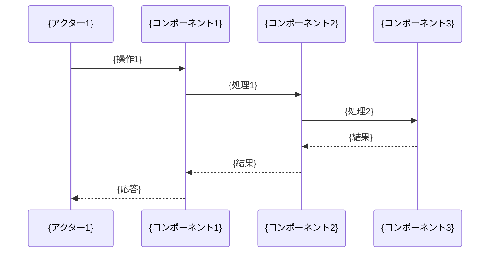
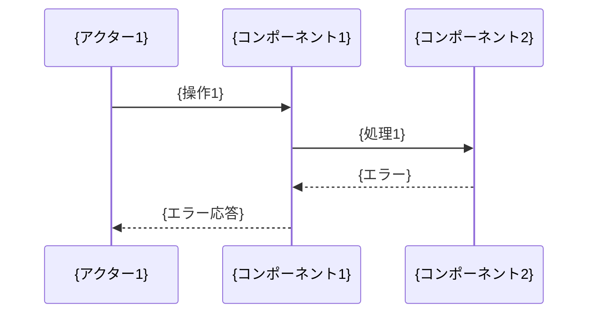

# Spec B{nn}-S{nn}: {機能名} — 設計書

## 概要

本設計書は、Spec {nn}「{機能名}」の要件定義（`requirements.md`）に基づき、{機能の簡潔な説明}の詳細設計を示します。

**前フェーズとの関係:**
- **前提**: Spec {前Spec番号}「{前Spec名}」により、{前フェーズで実装された内容}が完成
- **今回の設計範囲**: {今回のSpecの設計対象}

**Phase 1の対象範囲:**
- {Phase 1で対象とする範囲を箇条書きで記載}

**確認した現状:**
- {requirements.md の手動作業プレフライトで確認したrepo設定・docs・secret管理方針}
- {対象機能に関係する既存コード、外部連携、CI/CD、deploy設定、runtime config}
- {未確認の外部状態がある場合は、未確認前提として扱う}

**設計原則:**
- repo内実装とユーザー手動作業を分離する
- secret値、token実値、credential、個人情報、dashboard screenshotのraw値を保存しない
- 未セットアップの外部依存は fail-closed または blocked として扱い、推測で完了済みにしない

---

## アーキテクチャ

### システム構成図

```mermaid
graph TB
    subgraph "{コンポーネント群1}"
        C1[{コンポーネント1}]
        C2[{コンポーネント2}]
    end
    
    subgraph "{コンポーネント群2}"
        C3[{コンポーネント3}]
        C4[{コンポーネント4}]
    end
    
    C1 -->|{関係}| C2
    C2 -->|{関係}| C3
    C3 -->|{関係}| C4
```

### レイヤー責務

| レイヤー | 責務 | 主要モジュール |
|---------|------|---------------|
| **{レイヤー1}** | {責務内容} | {モジュール名} |
| **{レイヤー2}** | {責務内容} | {モジュール名} |
| **{レイヤー3}** | {責務内容} | {モジュール名} |

---

## データフロー（主要ユースケース）

### ユースケース1: {ユースケース名}（正常系）



### ユースケース2: {ユースケース名}（エラー系）



---

## コンポーネントとインターフェース

> **📝 プロジェクトの性質に応じたカスタマイズ**:
> - **ソフトウェア開発**: TypeScript/Python/Go等のコード例を記載
> - **データ分析基盤**: BigQuery SQL、ビュー定義、スケジューラ設定などを記載
> - **インフラ構成**: Terraform HCL、YAMLマニフェスト、設定ファイルなどを記載

### 1. {コンポーネント名} (`{ファイルパス}`)

#### インターフェース

**ソフトウェア開発プロジェクトの場合:**
```typescript
/**
 * {コンポーネントの説明}
 */
export interface {インターフェース名} {
  {プロパティ1}: {型};
  {プロパティ2}: {型};
}

/**
 * {クラス/関数の説明}
 * 
 * @param {パラメータ名} - {パラメータの説明}
 * @returns {戻り値の説明}
 */
export class {クラス名} {
  async {メソッド名}({パラメータ}: {型}): Promise<{戻り値型}>;
}
```

**データ分析基盤プロジェクトの場合:**
```sql
-- {コンポーネントの説明}
-- ファイル: {ファイルパス}

CREATE OR REPLACE TABLE `{プロジェクトID}.{データセット名}.{テーブル名}` AS
SELECT
  {カラム1},
  {カラム2},
  {集計関数}({カラム3}) AS {集計結果}
FROM
  `{ソーステーブル}`
WHERE
  {条件}
GROUP BY
  {グループ化カラム}
```

#### 実装詳細

**ソフトウェア開発プロジェクトの場合:**
```typescript
// {ファイルパス}
import { {インポート対象} } from '{パス}';

export class {クラス名} {
  private {プロパティ}: {型};

  constructor() {
    // {初期化処理の説明}
  }

  async {メソッド名}({パラメータ}: {型}): Promise<{戻り値型}> {
    // 1. {処理ステップ1}
    // 2. {処理ステップ2}
    // 3. {処理ステップ3}
    return {結果};
  }
}
```

**データ分析基盤プロジェクトの場合:**
```sql
-- {処理の説明}
-- 実行頻度: {頻度}
-- 想定実行時間: {時間}
-- 想定コスト: {コスト}

-- 1. {処理ステップ1}
WITH base_data AS (
  SELECT * FROM `{ソーステーブル}`
  WHERE {条件}
),

-- 2. {処理ステップ2}
aggregated_data AS (
  SELECT
    {カラム1},
    COUNT(*) AS record_count
  FROM base_data
  GROUP BY {カラム1}
)

-- 3. {最終結果生成}
SELECT * FROM aggregated_data
```

#### 制約・注意事項
- **{制約項目1}**: {制約内容}
- **{制約項目2}**: {制約内容}

---

### 2. {コンポーネント名} (`{ファイルパス}`)

#### インターフェース

**疑似コード（プロジェクト非依存）:**
```
COMPONENT {コンポーネント名}
  INPUT: {入力データ型}
  OUTPUT: {出力データ型}
  
  FUNCTION {関数名}(parameters):
    1. {処理ステップ1}
    2. {処理ステップ2}
    3. RETURN {結果}
```

#### 実装詳細

{プロジェクトの性質に応じて、適切な実装例を記載}

#### 制約・注意事項
- **{制約項目1}**: {制約内容}
- **{制約項目2}**: {制約内容}

---

## データモデル

### {データモデル名}

{データモデルの説明}

| カラム名 | 型 | 説明 | 備考 |
|---------|-----|------|------|
| `{カラム1}` | {型} | {説明} | {備考} |
| `{カラム2}` | {型} | {説明} | {備考} |

**詳細**: `{参照ドキュメント}`

---

## エラーハンドリング

### エラー分類と対応

| エラー種別 | 原因 | 対応 | HTTPステータス | ログレベル |
|-----------|------|------|---------------|-----------|
| **{エラー種別1}** | {原因} | {対応} | {ステータス} | {レベル} |
| **{エラー種別2}** | {原因} | {対応} | {ステータス} | {レベル} |

### 統一エラーレスポンス形式

```typescript
// エラーメッセージの構造
interface ErrorResponse {
  {プロパティ1}: {型};
  {プロパティ2}: {型};
}

// 返答例
{
  {プロパティ1}: {値},
  {プロパティ2}: {値}
}
```

---

## テスト戦略

### 単体テスト

#### テスト対象: `{モジュール名}`
- **テスト1**: {テスト名}
  - 入力: {入力内容}
  - 期待: {期待結果}
- **テスト2**: {テスト名}
  - 入力: {入力内容}
  - 期待: {期待結果}

### 統合テスト

#### テスト3: {テスト名}
- **入力**: {入力内容}
- **期待**:
  - {期待結果1}
  - {期待結果2}

### セキュリティテスト

#### テスト4: {テスト名}
- **実行**: {実行内容}
- **期待**: {期待結果}

---

## デプロイメント設計

### パッケージ依存関係

```json
{
  "dependencies": {
    "{パッケージ名}": "{バージョン}"
  },
  "devDependencies": {
    "{パッケージ名}": "{バージョン}"
  }
}
```

### {デプロイ先}設定

```bash
# デプロイコマンド例
{デプロイコマンド}
```

**設定値の根拠**:
- `{設定項目1}`: {根拠}
- `{設定項目2}`: {根拠}

---

## 外部依存・手動作業設計

### 実装境界

| 区分 | AIが実装すること | ユーザー手動作業 | 未完了時の挙動 |
|------|------------------|------------------|----------------|
| {例: 外部API連携} | {client / adapter / mock / contract test} | {API token発行、secret manager登録、plan有効化} | {live checkをblocked、adapterはmockで検証} |
| {例: OAuth / webhook} | {callback route、署名検証、fixture test} | {OAuth app作成、redirect URI登録、webhook secret設定} | {認可失敗をfail-closed} |
| {例: cloud resource / DNS} | {IaC / config / smoke script} | {resource作成承認、DNS/TLS/Access policy設定} | {deploy/live smokeをblocked} |
| {例: DB migration / data operation} | {migration file、dry-run、rollback plan} | {target env apply承認、backfill/purge実行承認} | {live data mutationは未実行として記録} |
| {例: mobile/release} | {runtime config、build flag、mock test} | {developer account、証明書、push key、TestFlight/Play Console設定} | {device/release live検証をblocked} |

### Secret / Config 管理

| 名称 | 用途 | 保存先 | AIの扱い | 手動作業 |
|------|------|--------|----------|----------|
| `{ENV_OR_SECRET_NAME}` | {用途} | {secret manager / CI secret / runtime secret / local template} | {値は読まない。placeholder名のみ扱う} | {発行・登録・rotation・権限確認} |

### Live Verification / Blocked Handling

- {手動作業が完了している場合にだけ実施するlive verification}
- {未完了時にblockedとして記録するAC / test / task}
- {fixture / mock / dry-runで継続できる検証範囲}
- {AIが未承認で実行しない操作: 本番deploy、live DB migration、課金変更、secret閲覧/登録、manual purgeなど}

---

## 制約・前提条件

### 技術制約
- **{技術要素1}**: {制約内容}
- **{技術要素2}**: {制約内容}

### Phase 1の制限
- **{制限項目1}**: {制限内容}
- **Phase 2以降で追加予定**: {拡張予定内容}

### 依存関係
- ✅ {前提条件1}
- ✅ {前提条件2}

---

## 完了条件

以下の全てを満たした場合、この設計書は完了とする:
1. ✅ {完了条件1}
2. ✅ {完了条件2}
3. ✅ {完了条件3}

---

## 参考資料

### プロジェクト内ドキュメント
- `spec/specs/B{nn}-S{nn}-{slug}/requirements.md`: 要件定義
- `blueprints/{nn}-{blueprint-slug}/architecture.md`: システムアーキテクチャ
- `docs/`: プロジェクトドキュメント

### 外部参照
- [{外部ドキュメント名}]({URL})
- [{外部ドキュメント名}]({URL})
