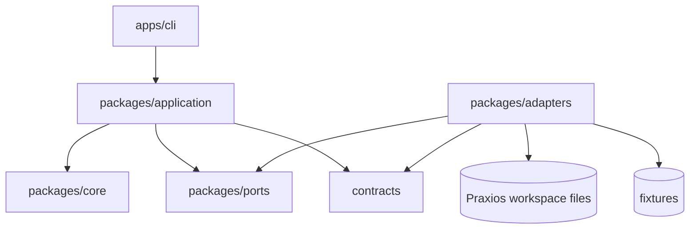
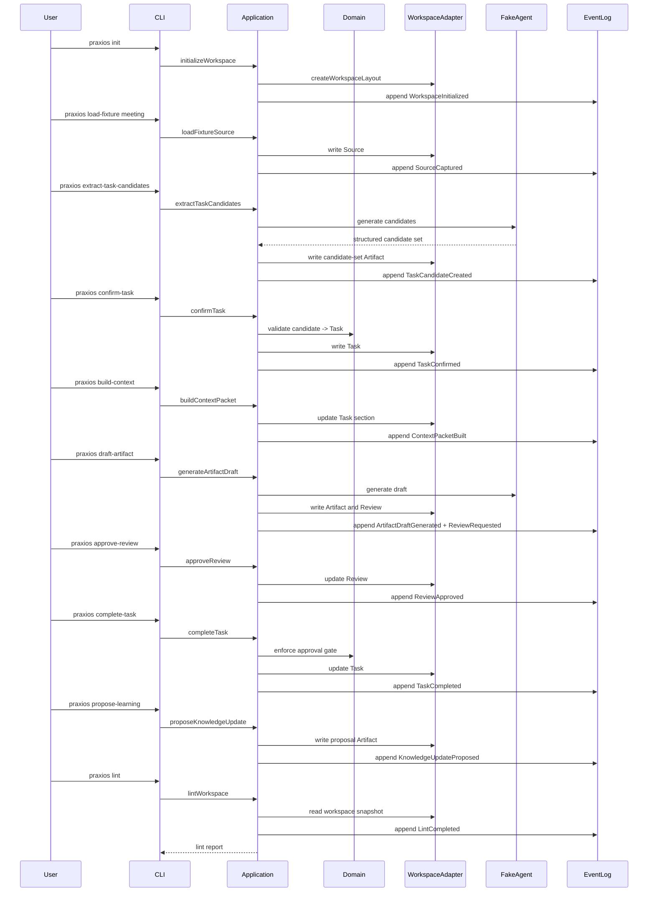

# Spec B01-S01: Local fixture workflow — 設計書

## 概要

本設計書は、`requirements.md` に基づき、local files と fixtures だけで Praxios の
最小 domain loop と trust model を検証するための設計を定義します。

**今回の設計範囲:**

- local plain-file workspace
- synthetic meeting transcript fixture
- deterministic fake agent adapter
- boundary contracts / validation
- Source capture
- TaskCandidate extraction
- Task confirmation
- ContextPacket section generation
- Artifact draft and Review simulation
- Task completion and Learning proposal
- append-only `log.md`
- workspace lint / health check

**非対象:**

- real external integrations
- external LLM provider dependency
- Web UI
- vector database
- production deployment
- multi-user permissions

## 技術選定

S01 の実装では、次を採用します。

- Runtime language: TypeScript
- Runtime: Node.js
- Package manager: pnpm
- Runtime validation: Zod
- Test framework: Vitest

理由:

- Praxios は `contracts/` で runtime validation を重視するため、TypeScript + Zod が
  境界契約を表現しやすい。
- CLI、filesystem adapter、Markdown processing、workflow tests を小さく始めやすい。
- 将来の web UI / worker / agent tool へ同じ application services を再利用しやすい。

この選定は S01 の実装判断です。将来の大きな runtime 変更が必要になった場合は、
別 ADR または後続 SDD spec で扱います。

## アーキテクチャ



### レイヤー責務

| レイヤー | 責務 | S01 の主な配置 |
|---|---|---|
| CLI | command parsing、結果表示、exit code | `apps/cli` |
| Application | workflow orchestration、policy coordination | `packages/application` |
| Domain | entities、commands、state transitions、invariants | `packages/core` |
| Ports | filesystem、agent、event log、clock、ID generation の抽象 | `packages/ports` |
| Adapters | Markdown workspace、fixture loader、fake agent | `packages/adapters` |
| Contracts | external / boundary input の runtime validation | `contracts` |

Domain は CLI、Markdown、filesystem、Zod、LLM provider に依存しません。
Zod schemas は contracts / adapters / application boundary で使い、domain invariant の
代替にしてはいけません。

## データフロー

### Happy path



### Approval failure path

`completeTask` は、Task に review requirement がある場合、その Task またはその
Task completion に使われる draft Artifact を `target_ref` に持ち、`decision:
approved` で、`approval_scope` が `task_completion` を含む Review がなければ domain
policy error `approval_required` を返します。別 Task や別 Artifact の approval、
または `task_completion` を含まない approval scope では gate を通してはいけません。
この場合 Task file は更新せず、必要に応じて failed attempt を `log.md` に記録できます。

## コンポーネントとインターフェース

### Application services

```typescript
export interface CommandContext {
  actor_id: string;
  agent_id?: string;
  task_ref?: string;
  allowed_source_refs: string[];
  allowed_knowledge_refs: string[];
  allowed_tools: string[];
  approval_refs: string[];
}

export interface WorkspaceService {
  initializeWorkspace(input: InitializeWorkspaceInput): Promise<InitializeWorkspaceResult>;
  loadFixtureSource(input: LoadFixtureSourceInput): Promise<SourceRecord>;
  extractTaskCandidates(input: ExtractTaskCandidatesInput): Promise<ArtifactRecord>;
  confirmTask(input: ConfirmTaskInput): Promise<TaskRecord>;
  buildContextPacket(input: BuildContextPacketInput): Promise<TaskRecord>;
  generateArtifactDraft(input: GenerateArtifactDraftInput): Promise<{
    artifact: ArtifactRecord;
    review: ReviewRecord;
  }>;
  approveReview(input: ApproveReviewInput): Promise<ReviewRecord>;
  completeTask(input: CompleteTaskInput): Promise<TaskRecord>;
  proposeKnowledgeUpdate(input: ProposeKnowledgeUpdateInput): Promise<ArtifactRecord>;
  lintWorkspace(input: LintWorkspaceInput): Promise<LintReport>;
}
```

### Ports

```typescript
export interface WorkspaceRepository {
  readWorkspace(path: WorkspacePath): Promise<WorkspaceSnapshot>;
  writeSource(source: SourceRecord): Promise<void>;
  writeTask(task: TaskRecord): Promise<void>;
  writeArtifact(artifact: ArtifactRecord): Promise<void>;
  writeReview(review: ReviewRecord): Promise<void>;
  updateTask(task: TaskRecord): Promise<void>;
  updateReview(review: ReviewRecord): Promise<void>;
}

export interface EventLog {
  append(entry: EventLogEntry): Promise<void>;
}

export interface EventLogEntry {
  event_id: string;
  occurred_at: string;
  actor_id: string;
  agent_id?: string;
  command: string;
  target: string;
  task_ref?: string;
  allowed_source_refs: string[];
  allowed_knowledge_refs: string[];
  allowed_tools: string[];
  approval_refs: string[];
  previous_status?: string;
  new_status?: string;
  result: "succeeded" | "failed" | "blocked";
  rationale: string;
  refs: string[];
}

export interface AgentGateway {
  extractTaskCandidates(input: AgentTaskCandidateInput): Promise<AgentTaskCandidateOutput>;
  generateArtifactDraft(input: AgentArtifactDraftInput): Promise<AgentArtifactDraftOutput>;
  proposeKnowledgeUpdate(input: AgentLearningInput): Promise<AgentKnowledgeProposalOutput>;
}

export interface IdGenerator {
  generate(prefix: IdPrefix): string;
}

export interface Clock {
  now(): Date;
}
```

All application service input types include `context: CommandContext`. AgentGateway input types also
include the same context so fake-agent output can be audited with actor, agent, task, source scope,
knowledge scope, tool scope, and approval refs.

### Adapters

- `MarkdownWorkspaceRepository`: workspace Markdown files を read/write する。
- `MarkdownEventLog`: `log.md` に event-like section を append する。
- `FixtureLoader`: bundled synthetic fixtures を読む。
- `DeterministicAgentAdapter`: fixed fixture input から deterministic output を返す。
- `SystemClock` and `UlidIdGenerator`: timestamp と stable ID を生成する。

S01 では external LLM adapter は実装しません。`AgentGateway` の interface は将来の
LLM provider adapter に備えます。

## データモデル

### Workspace layout

```text
praxios-workspace/
  sources/
  knowledge/
  tasks/
  artifacts/
  reviews/
  log.md
  praxios.md
  .praxios/
    config.yaml
```

### ID と refs

| Type | Prefix |
|---|---|
| Source | `src_` |
| Knowledge | `know_` |
| Task | `task_` |
| Artifact | `artifact_` |
| Review | `review_` |
| Event | `event_` |

Canonical references は ID refs です。Markdown links は人間向け補助表現であり、
machine reference の正本ではありません。

### TaskCandidate storage

S01 では `task-candidates/` directory を作りません。

TaskCandidate extraction の結果は、`artifacts/*.md` に
`artifact_kind: task_candidate_set` として保存します。これにより、候補は generated
output として reviewable / inspectable になりますが、confirmed Task とは別物のままです。
Candidate set は Task confirm 前に作られるため、frontmatter に `task_ref` を要求せず、
S01 では `task_ref` を持たせません。confirmed Task との関係は、Task 側の
`trigger_refs` から candidate set Artifact を参照して表現します。

Candidate set の本文には候補ごとの local key を持たせます。

```markdown
## Task Candidates

### candidate-1

- title: ...
- source_refs:
  - src_...
- proposed_done_criteria:
  - ...
- confidence: medium
- uncertainty: ...
- extraction_rationale: ...
```

`confirm-task` は `artifact_...` と `candidate-1` の組を入力に取り、confirmed Task を
作ります。Task は新しい `task_` ID を持ち、candidate set Artifact への ref を
`trigger_refs` に残します。

### ContextPacket section

S01 では ContextPacket を top-level file にしません。Task body 内の
`## Context Packet` section に、次の最小構造を記録します。

```markdown
## Context Packet

- built_at: 2026-06-23T10:15:00+09:00
- source_refs:
  - src_...
- knowledge_refs: []
- allowed_tools:
  - deterministic-agent
- sensitivity: internal

### Constraints

- ...

### Missing Information

- ...

### Risks

- ...

### Draft Inputs

- ...
```

`source_refs` と `knowledge_refs` は `CommandContext` の allowed scope の subset で
なければなりません。ContextPacket builder は unrelated Source / Knowledge を混ぜず、
sensitivity を保持します。

### Frontmatter minimum

| Record | Required fields |
|---|---|
| Source | `id`, `type`, `title`, `status`, `created`, `updated`, `origin`, `observed_at`, `content_hash`, `sensitivity` |
| Task | `id`, `type`, `title`, `status`, `created`, `updated`, `trigger_refs`, `source_refs`, `knowledge_refs`, `done_criteria`, `review_required` |
| Artifact base | `id`, `type`, `artifact_kind`, `title`, `status`, `created`, `updated`, `source_refs`, `generated_by`, `review_required` |
| Task candidate set Artifact | Stored as Artifact with `artifact_kind: task_candidate_set`; `task_ref` is not required and MUST NOT be invented before Task confirmation |
| Task-bound Artifact | Generated draft Artifacts tied to a confirmed Task require `task_ref` |
| Review | `id`, `type`, `title`, `status`, `created`, `updated`, `target_ref`, `requested_by`, `decision`, `rationale`, `approval_scope` |
| Knowledge proposal | Stored as Artifact with `artifact_kind: knowledge_update_proposal`, `task_ref`, `source_refs`, `confidence` or `uncertainty` |

### Knowledge update proposal body

`artifact_kind: knowledge_update_proposal` は専用の body structure を持ちます。

```markdown
## Proposed Change

...

## Rationale

...

## Evidence

- source_refs:
  - src_...
- task_ref: task_...

## Confidence

- confidence: medium
- uncertainty: ...
```

The proposal must not mutate active Knowledge directly. A future review or command can promote it
to Knowledge.

### `log.md` entry

```markdown
## 2026-06-23T10:15:00+09:00 - Task completed

- event_id: event_...
- actor_id: user
- agent_id: deterministic-agent
- command: CompleteTask
- target: task_...
- task_ref: task_...
- allowed_source_refs:
  - src_...
- allowed_knowledge_refs: []
- allowed_tools:
  - deterministic-agent
- approval_refs:
  - review_...
- previous_status: active
- new_status: completed
- result: succeeded
- rationale: Done criteria met.
- refs:
  - artifact_...
  - review_...
```

`log.md` is append-only in normal operation. S01 does not implement strict event replay.

## Contracts

S01 creates runtime validation contracts in `contracts/`.

Initial contracts:

- `ids.schema.ts`
- `source.schema.ts`
- `task-candidate.schema.ts`
- `task.schema.ts`
- `artifact.schema.ts`
- `review.schema.ts`
- `event-log.schema.ts`
- `lint.schema.ts`

Contracts validate shape, required fields, enum values, ID prefix, and reference format.
Artifact contracts also validate `artifact_kind`-specific requirements, including that
`task_candidate_set` does not need a pre-existing `task_ref` while task-bound Artifacts do.
They do not authorize state transitions. State transition policy remains in domain logic.

## Error handling

Use typed application errors with stable `code` values.

| Code | Meaning | Behavior |
|---|---|---|
| `invalid_workspace` | workspace layout or config is missing/invalid | fail closed |
| `invalid_frontmatter` | Markdown frontmatter fails contract validation | fail closed |
| `missing_reference` | ID refs point to missing records | fail closed for write operations |
| `invalid_transition` | domain state transition is not allowed | fail closed |
| `approval_required` | Review gate blocks action | fail closed |
| `fixture_not_found` | requested fixture does not exist | fail closed |
| `lint_failed` | high-severity lint issues exist | report; do not auto-fix |

CLI should print actionable messages and non-zero exit codes for failures.

## Workspace lint

`lintWorkspace` reads a workspace snapshot and returns a structured `LintReport`.
It also appends a `LintCompleted` entry to `log.md` using the shared `EventLogEntry`
contract. The entry uses `command: LintWorkspace`, `target: workspace`, `result`,
`rationale`, and refs to the checked workspace or generated report when available.

Minimum S01 lint rules:

- Required frontmatter exists.
- `id` prefix, `type`, and directory agree.
- Status value is valid for the record type.
- IDs are unique.
- ID refs point to existing records.
- Source records have `content_hash`.
- Task records have non-empty `done_criteria`.
- Review-required completed Task has an approved Review whose `target_ref` matches the Task
  or completion Artifact and whose `approval_scope` includes `task_completion`.
- Artifact with generated output is not referenced as Source evidence.
- `log.md` has required fields for major transitions created by S01.

Lint result includes:

- severity: `high` / `medium` / `low`
- code
- message
- target file or ID
- suggested action

S01 lint does not auto-fix.

## Testing strategy

S01 test suite:

- Unit tests for contracts.
- Unit tests for domain state transitions.
- Unit tests for lint rules.
- Adapter tests for Markdown read/write and frontmatter validation.
- Workflow test for happy path from workspace init to lint.
- Failure tests:
  - duplicate fixture import
  - missing required frontmatter
  - invalid ID prefix
  - complete Task before approval
  - generated Artifact referenced as Source evidence

No live external service verification is required.

## 外部依存・手動作業設計

追加手動作業なし。

- No account signup.
- No API token.
- No OAuth app.
- No webhook.
- No deployment.
- No production data.
- No external LLM provider dependency.

Package installation may require network access during implementation, but this is ordinary local
development setup, not product runtime dependency or user-managed external service setup.

## Implementation notes

- Keep generated templates small.
- Do not create empty future directories until tasks require them.
- Do not implement Quartz, SaaS sync, external integrations, or background workers in S01.
- If Design and implementation reveal that TaskCandidate requires a first-class workspace file,
  stop and update this spec before adding a new top-level directory.
